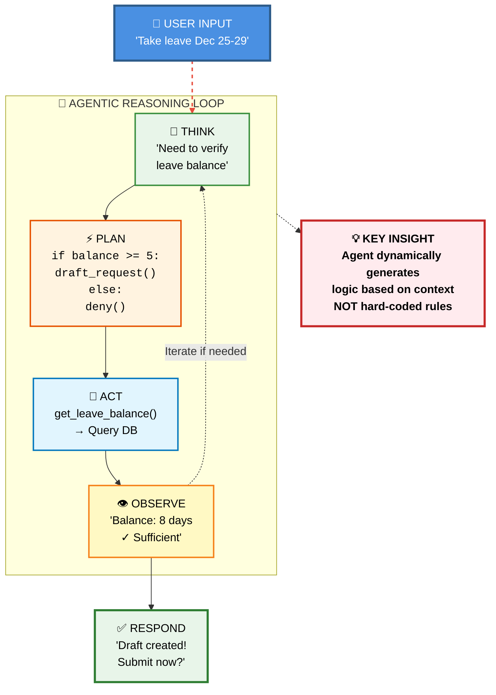
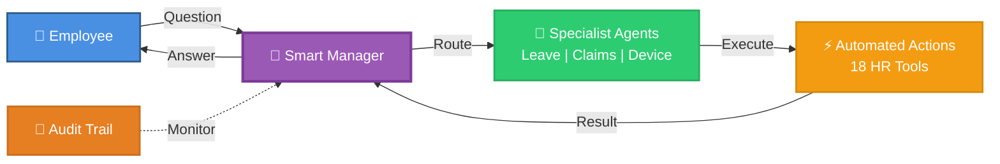
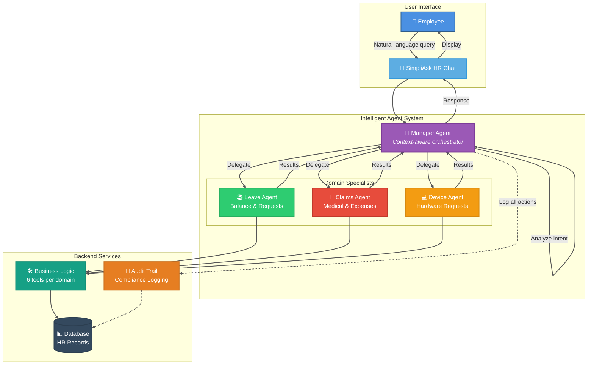

# SimpliAsk HR Agent 🤖

An intelligent multi-agent HR assistant system that automates employee HR requests through natural language conversation. Built with a manager-specialist agent orchestration pattern for handling leave requests, medical claims, and device requisitions.

[](https://www.python.org/downloads/)
[](https://openai.com/)
[](https://gradio.app/)
[](LICENSE)

## 🎯 Overview

SimpliAsk HR Agent is an enterprise-grade conversational AI system that streamlines HR processes through intelligent agent orchestration. Employees can submit leave requests, file medical claims, and request devices using natural language, while the system handles intent recognition, context management, and compliance logging automatically.

### Key Features

- 🎯 **Intelligent Manager Agent**: Context-aware orchestrator with multi-turn conversation support
- 🤖 **Specialized Domain Agents**: Dedicated agents for Leave, Claims, and Device management
- 🛠️ **18 Automated HR Tools**: Complete workflow automation from draft to submission
- 📝 **Audit Trail**: Full compliance logging for all interactions and decisions
- 💬 **Natural Language Interface**: Gradio-powered chat UI for seamless user experience
- 🔄 **Session Management**: Maintains context across conversations

---

## 📐 Architecture

### Agent Reasoning Loop

Each specialist agent in SimpliAsk uses an iterative reasoning loop to process requests intelligently. Unlike traditional rule-based systems, our agents dynamically generate logic and iterate until they have complete information:



**Why This Matters:**
- 🧠 **Adaptive Intelligence**: Agents reason through each step rather than following fixed scripts
- 🔄 **Iterative Problem Solving**: Loop continues until all information is gathered
- ⚡ **Dynamic Code Generation**: Plans are generated on-the-fly based on context
- 🎯 **Context-Aware**: Each decision considers the full conversation history

---

### High-Level Overview



### Simplified Architecture



### Detailed System Architecture

```mermaid
graph TB
    subgraph "User Interface Layer"
        User[User]
        Gradio[Gradio Chat Interface<br/>SimpliAsk HR Agent]
    end

    subgraph "Application Layer"
        UnifiedChat[unified_chat Function<br/>- Session Management<br/>- Context Building<br/>- Response Cleaning]
        SessionMgmt[Session Management<br/>generate_session_id]
    end

    subgraph "Agent Orchestration Layer"
        ManagerAgent[Manager Agent<br/>hr_manager<br/>CodeAgent<br/>Model: gpt-4.1-mini]
        
        subgraph "Manager Responsibilities"
            IntentRecog[Intent Recognition]
            ContextAware[Context Awareness<br/>Multi-turn Conversations]
            Clarification[Clarification Handler]
            Delegation[Delegation Logic]
        end
    end

    subgraph "Specialist Agents Layer"
        LeaveAgent[Leave Specialist<br/>leave_smol_agent<br/>ToolCallingAgent]
        ClaimsAgent[Claims Specialist<br/>claims_smol_agent<br/>ToolCallingAgent]
        DeviceAgent[Device Specialist<br/>device_smol_agent<br/>ToolCallingAgent]
    end

    subgraph "Tools Layer - Leave"
        LT1[get_leave_balance_tool]
        LT2[draft_leave_request_tool]
        LT3[submit_draft_leave_request_tool]
        LT4[submit_leave_request_tool]
        LT5[list_leave_drafts_tool]
        LT6[check_leave_status_tool]
    end

    subgraph "Tools Layer - Claims"
        CT1[list_claims_tool]
        CT2[draft_medical_claim_tool]
        CT3[update_medical_claim_tool]
        CT4[submit_medical_claim_tool]
    end

    subgraph "Tools Layer - Device"
        DT1[get_available_devices_tool]
        DT2[draft_device_request_tool]
        DT3[submit_draft_device_request_tool]
        DT4[submit_device_request_tool]
        DT5[list_device_drafts_tool]
        DT6[check_device_request_status_tool]
    end

    subgraph "Business Logic Layer"
        LeaveTools[leave_tools.py<br/>- Balance Management<br/>- Draft Creation<br/>- Submission Logic]
        ClaimsTools[claims_tools.py<br/>- Claims Listing<br/>- Draft Management<br/>- Receipt Processing]
        DeviceTools[device_tools.py<br/>- Device Catalog<br/>- Request Management<br/>- Status Tracking]
    end

    subgraph "Audit & Logging Layer"
        AuditHelper[audit_helper.py<br/>log_agent_interaction]
        AuditTrail[audit_trail.py<br/>AuditTrail Class<br/>SQLite Database]
        AuditViewer[audit_viewer.py<br/>- View Logs<br/>- Generate Reports<br/>- Export Data]
    end

    subgraph "Data Storage Layer"
        AuditDB[(Audit Trail DB<br/>audit_trail.db<br/>- audit_log<br/>- tool_calls<br/>- agent_delegations)]
        ClaimsDB[(Claims POC DB<br/>claims_poc.db<br/>- Leave Data<br/>- Claims Data<br/>- Device Data)]
    end

    subgraph "Configuration Layer"
        EnvVars[.env Configuration<br/>- OPENAI_API_KEY<br/>- ANTHROPIC_API_KEY<br/>- GOOGLE_API_KEY]
        SmolBase[smol_base.py<br/>get_smol_model<br/>Model: gpt-4.1-mini]
    end

    %% User Flow
    User -->|Natural Language Query| Gradio
    Gradio -->|message, history| UnifiedChat
    UnifiedChat -->|build_context| ManagerAgent
    
    %% Manager Agent Internal Flow
    ManagerAgent --> IntentRecog
    IntentRecog --> ContextAware
    ContextAware --> Clarification
    Clarification -->|Complete Info| Delegation
    Clarification -->|Missing Info| UnifiedChat
    
    %% Delegation to Specialists
    Delegation -->|Leave Request| LeaveAgent
    Delegation -->|Medical Claim| ClaimsAgent
    Delegation -->|Device Request| DeviceAgent
    
    %% Specialist to Tools
    LeaveAgent --> LT1 & LT2 & LT3 & LT4 & LT5 & LT6
    ClaimsAgent --> CT1 & CT2 & CT3 & CT4
    DeviceAgent --> DT1 & DT2 & DT3 & DT4 & DT5 & DT6
    
    %% Tools to Business Logic
    LT1 & LT2 & LT3 & LT4 & LT5 & LT6 --> LeaveTools
    CT1 & CT2 & CT3 & CT4 --> ClaimsTools
    DT1 & DT2 & DT3 & DT4 & DT5 & DT6 --> DeviceTools
    
    %% Business Logic to Database
    LeaveTools --> ClaimsDB
    ClaimsTools --> ClaimsDB
    DeviceTools --> ClaimsDB
    
    %% Audit Trail Flow
    UnifiedChat -->|Log Interaction| AuditHelper
    AuditHelper --> AuditTrail
    AuditTrail --> AuditDB
    AuditViewer -.->|Query| AuditDB
    
    %% Session Management
    UnifiedChat --> SessionMgmt
    SessionMgmt --> AuditHelper
    
    %% Response Flow
    LeaveAgent -->|Response| ManagerAgent
    ClaimsAgent -->|Response| ManagerAgent
    DeviceAgent -->|Response| ManagerAgent
    ManagerAgent -->|clean_response| UnifiedChat
    UnifiedChat -->|Return| Gradio
    Gradio -->|Display| User
    
    %% Configuration
    EnvVars -.->|API Keys| SmolBase
    SmolBase -.->|Model Config| ManagerAgent
    SmolBase -.->|Model Config| LeaveAgent
    SmolBase -.->|Model Config| ClaimsAgent
    SmolBase -.->|Model Config| DeviceAgent

    classDef userLayer fill:#e1f5ff,stroke:#0288d1,stroke-width:2px
    classDef appLayer fill:#fff9c4,stroke:#f57f17,stroke-width:2px
    classDef agentLayer fill:#f3e5f5,stroke:#7b1fa2,stroke-width:2px
    classDef toolLayer fill:#e8f5e9,stroke:#388e3c,stroke-width:2px
    classDef dataLayer fill:#fce4ec,stroke:#c2185b,stroke-width:2px
    classDef auditLayer fill:#fff3e0,stroke:#e65100,stroke-width:2px
    
    class User,Gradio userLayer
    class UnifiedChat,SessionMgmt appLayer
    class ManagerAgent,LeaveAgent,ClaimsAgent,DeviceAgent,IntentRecog,ContextAware,Clarification,Delegation agentLayer
    class LT1,LT2,LT3,LT4,LT5,LT6,CT1,CT2,CT3,CT4,DT1,DT2,DT3,DT4,DT5,DT6,LeaveTools,ClaimsTools,DeviceTools toolLayer
    class AuditDB,ClaimsDB dataLayer
    class AuditHelper,AuditTrail,AuditViewer auditLayer
```

<details>
<summary>Click to expand full technical architecture diagram</summary>



</details>

---

## 🚀 Getting Started

### Prerequisites

- Python 3.8 or higher
- OpenAI API key
- (Optional) Anthropic API key
- (Optional) Google API key

### Installation

1. Clone the repository
```bash
git clone https://github.com/yourusername/simpliask-hr-agent.git
cd simpliask-hr-agent
```

2. Install dependencies
```bash
pip install -r requirements.txt
```

3. Configure environment variables
```bash
cp .env.example .env
# Edit .env and add your API keys
```

4. Initialize the database
```bash
python setup_database.py
```

5. Run the application
```bash
python app.py
```

The Gradio interface will be available at `http://localhost:7860`

---

## 💬 Usage Examples

### Leave Request
```
Employee: "I want to take leave from December 25th to 29th"
Agent: "I can help you with that. Let me check your leave balance first..."
```

### Medical Claim
```
Employee: "I need to submit a medical claim for my doctor visit"
Agent: "I'll help you file a medical claim. Could you provide the date of visit and amount?"
```

### Device Request
```
Employee: "What laptops are available for request?"
Agent: "Here are the available devices..."
```

---

## 🏗️ Project Structure

```
simpliask-hr-agent/
├── agents/
│   ├── manager_agent.py      # Main orchestration agent
│   ├── leave_agent.py         # Leave management specialist
│   ├── claims_agent.py        # Medical claims specialist
│   └── device_agent.py        # Device request specialist
├── tools/
│   ├── leave_tools.py         # Leave-related operations
│   ├── claims_tools.py        # Claims-related operations
│   └── device_tools.py        # Device-related operations
├── audit/
│   ├── audit_helper.py        # Logging utilities
│   ├── audit_trail.py         # Audit trail management
│   └── audit_viewer.py        # Audit log viewer
├── database/
│   ├── audit_trail.db         # Audit logs database
│   └── claims_poc.db          # Business data database
├── config/
│   ├── smol_base.py          # Model configuration
│   └── .env                   # Environment variables
├── app.py                     # Main application entry point
├── unified_chat.py            # Chat orchestration logic
└── README.md
```

---

## 🎨 Key Components

### Manager Agent
- **Role**: Central orchestrator that analyzes user intent and delegates to specialist agents
- **Capabilities**: 
  - Context-aware conversation management
  - Intent recognition and classification
  - Clarification handling for ambiguous requests
  - Multi-turn conversation support
- **Model**: GPT-4.1-mini

### Specialist Agents

#### 🏖️ Leave Agent
Handles all leave-related operations:
- Check leave balance
- Draft and submit leave requests
- View leave drafts
- Check leave status

#### 🏥 Claims Agent
Manages medical claims:
- List existing claims
- Draft new medical claims
- Update claim details
- Submit claims for processing

#### 💻 Device Agent
Processes device requisitions:
- Browse available devices
- Draft device requests
- Submit device requisitions
- Track request status

### Audit System
- **Purpose**: Compliance and monitoring
- **Features**:
  - Logs all user interactions
  - Tracks tool calls and agent delegations
  - Provides audit reports
  - Supports data export

---

## 🔧 Configuration

### Environment Variables

```env
# Required
OPENAI_API_KEY=your_openai_api_key_here

# Optional - for multi-model support
ANTHROPIC_API_KEY=your_anthropic_api_key_here
GOOGLE_API_KEY=your_google_api_key_here
```

### Model Configuration

The system uses GPT-4.1-mini by default. To change models, modify `config/smol_base.py`:

```python
def get_smol_model():
    return ChatOpenAI(
        model="gpt-4.1-mini",
        temperature=0.7
    )
```

---

## 📊 Database Schema

### Audit Trail Database
- **audit_log**: Main interaction logs
- **tool_calls**: Individual tool execution records
- **agent_delegations**: Manager-to-specialist delegation tracking

### Business Database
- **leave_data**: Employee leave balances and requests
- **claims_data**: Medical claim records
- **device_data**: Device inventory and requests

---

## 🛠️ Development

### Adding a New Specialist Agent

1. Create agent file in `agents/` directory
2. Define tools in `tools/` directory
3. Register agent with manager in `agents/manager_agent.py`
4. Update delegation logic

### Running Tests

```bash
pytest tests/
```

### Viewing Audit Logs

```bash
python audit/audit_viewer.py
```

---

## 🔒 Security & Compliance

- All interactions are logged for audit purposes
- PII handling follows best practices
- Session management ensures data isolation
- Database access is controlled and logged

---

## 🤝 Contributing

Contributions are welcome! Please follow these steps:

1. Fork the repository
2. Create a feature branch (`git checkout -b feature/AmazingFeature`)
3. Commit your changes (`git commit -m 'Add some AmazingFeature'`)
4. Push to the branch (`git push origin feature/AmazingFeature`)
5. Open a Pull Request

---

## 📝 License

This project is licensed under the MIT License - see the [LICENSE](LICENSE) file for details.

---

## 🙏 Acknowledgments

- Built with [Gradio](https://gradio.app/) for the UI
- Powered by [OpenAI GPT-4.1-mini](https://openai.com/)
- Agent framework inspired by LangChain patterns

---

## 📧 Contact

**Mark Tan** - AI & Microservices Engineer

- GitHub: [@zerriet](https://github.com/zerriet)
- LinkedIn: [mark_tan](https://www.linkedin.com/in/mark-tan-jen-wei/)
- Email: zerriet@gmail.com

---

## 🗺️ Roadmap

- [ ] Add support for more HR processes (payroll, attendance)
- [ ] Implement voice interface
- [ ] Multi-language support
- [ ] Mobile app integration
- [ ] Advanced analytics dashboard
- [ ] Integration with existing HR systems (SAP, Workday)

---

**Made with ❤️ by Mark Tan**
